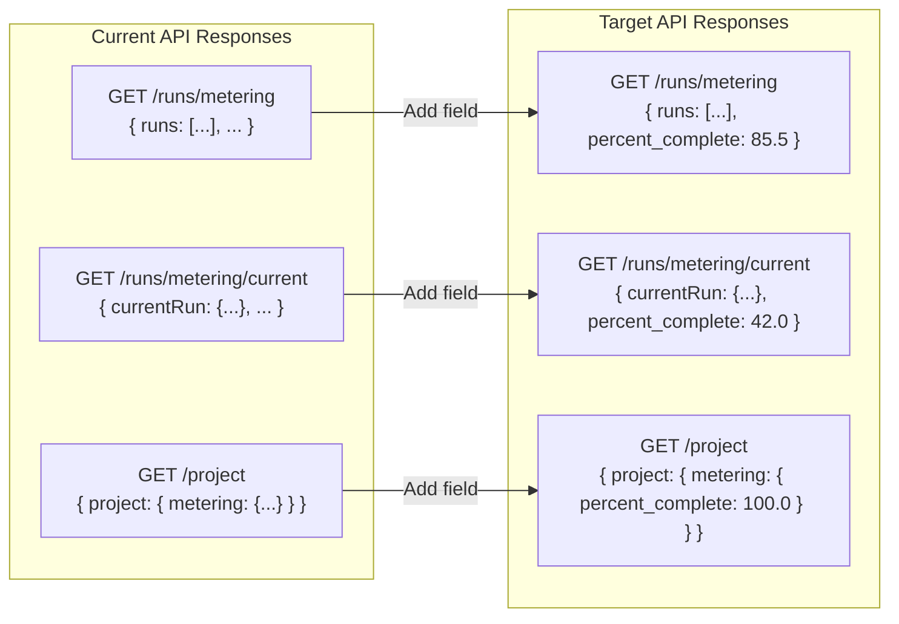

# Technical Specification

# 0. Agent Action Plan

## 0.1 Intent Clarification

### 0.1.1 Core Refactoring Objective

Based on the prompt, the Blitzy platform understands that the refactoring objective is to **augment three existing Blitzy Platform API endpoints** with a new progress-tracking field (`percent_complete` / `percentComplete`) that reports the completion percentage of code generation project runs. The field must be present in the JSON response payload of all three target APIs, returning a numeric value between 0.0 and 100.0 (inclusive) or `null` when not applicable.

- **Refactoring type**: API Response Schema Enhancement — extending existing API response models to include a new progress metering field across multiple endpoints
- **Target repository**: Same repository (`6thaprilrefactor`) — this is a greenfield repository that will house the refactored API logic
- **Refactoring goals with enhanced clarity**:
  - **Goal 1 — Field Addition**: Introduce the `percent_complete` (or `percentComplete`) field to the response schema of `GET /runs/metering`, `GET /runs/metering/current`, and `GET /project`
  - **Goal 2 — Data Type Enforcement**: The field must be a floating-point number (0.0–100.0) or explicitly `null` — never a string, boolean, or any other type
  - **Goal 3 — Consistent Naming**: The field name must be uniform across all three endpoints (either `percent_complete` or `percentComplete`, not a mix of both)
  - **Goal 4 — Contextual Relevance**: The field is specific to **code generation project runs** and must reflect actual run progress state (completed runs = 0–100, in-progress runs = value less than 100, no data = `null`)
  - **Goal 5 — Edge Case Handling**: Values must be clamped to the 0.0–100.0 range; out-of-range values (> 100 or < 0) and incorrect data types are considered bugs
- **Implicit requirements surfaced**:
  - Maintain backward compatibility — existing consumers of these APIs must not break when the new field is added
  - Preserve all existing response fields — only additive changes are permitted
  - API behavior must be consistent across all deployment environments (dev, qa, stage, prod)

### 0.1.2 Technical Interpretation

This refactoring translates to the following technical transformation strategy:

- **Current architecture**: Three API endpoints (`/runs/metering`, `/runs/metering/current`, `/project`) currently return metering and project data without a run-completion percentage field
- **Target architecture**: The same three endpoints return their existing payloads augmented with a `percent_complete` field that tracks code generation progress
- **Transformation rules and patterns**:
  - Each API response model gains a new nullable numeric field
  - The field is computed from run state data — mapping run progress to a 0.0–100.0 percentage
  - Null handling: when no metering data exists or the run has no progress context, the field returns `null`
  - The `/project` endpoint embeds the field within inline metering data, requiring nested response model updates



- **Validation matrix** derived from user requirements:

| Scenario | Expected Value | Valid |
|----------|---------------|-------|
| Completed run | 0.0–100.0 | Yes |
| In-progress run | Less than 100.0 | Yes |
| No data available | `null` | Yes |
| Field missing entirely | N/A | Bug |
| Value greater than 100 | N/A | Bug |
| Value less than 0 | N/A | Bug |
| String instead of number | N/A | Bug |


## 0.2 Source Analysis

### 0.2.1 Comprehensive Source File Discovery

The repository (`6thaprilrefactor`) is currently a **greenfield repository** containing a single file. A thorough inspection was performed using `get_source_folder_contents` on the root directory, confirming the minimal repository state.

**Current Repository Structure:**

```
Current:
/
└── README.md (1 line — project title heading only)
```

**Discovery methodology applied:**
- Root folder contents retrieved via `get_source_folder_contents("")` — returned a single child: `README.md`
- File content verified via `read_file("README.md")` — contains only `# 6thaprilrefactor`
- No `.blitzyignore` files found via filesystem search
- No environment files found at `/tmp/environments_files/`
- No attachments provided by the user

### 0.2.2 Current Structure Mapping

Since the repository is effectively empty, the source analysis focuses on the **Blitzy Platform API surface** described in the user's requirements and the system context from the Technical Specification.

**APIs requiring modification (from user requirements):**

| API Endpoint | Trigger Context | Current Behavior |
|-------------|----------------|-----------------|
| `GET /runs/metering?projectId=xxx` | Viewing run history, fetching metering data for multiple runs | Returns metering data without `percent_complete` field |
| `GET /runs/metering/current` | Live run status, auto-refresh polling | Returns current run metering without `percent_complete` field |
| `GET /project?id=xxx` | Opening a project page | Returns project data with embedded metering without `percent_complete` field |

**Platform context from Technical Specification:**
- The Blitzy Platform's Reverse Document Generator tracks metering via `estimated_hours_saved` and `estimated_lines_generated` fields in `ReverseDocumentState`
- The `estimate_metering` node in the pipeline (lines 998–1042 of `helper.py`) calculates value metrics
- Progress events are published via Pub/Sub with `current_index` and `total_steps` — the `percent_complete` field likely derives from these values
- The platform Admin Service (`SERVICE_URL_ADMIN`) handles metadata retrieval and project information

### 0.2.3 Comprehensive Source File Listing

| File Path | Status | Description |
|-----------|--------|-------------|
| `README.md` | EXISTS | Repository README with project title `6thaprilrefactor` only |

**No additional source files exist in the repository.** All implementation will be new code creation targeting the three API endpoints specified in the user's requirements. The refactoring will introduce API route handlers, response models, validation logic, and test suites as new files.


## 0.3 Scope Boundaries

### 0.3.1 Exhaustively In Scope

**Source transformations:**
- `src/**/*.py` — All Python source files for API route handlers, response models, and business logic
- `src/api/runs/**` — Route handlers for `/runs/metering` and `/runs/metering/current` endpoints
- `src/api/project/**` — Route handler for `/project` endpoint with inline metering data
- `src/models/**` — Response model definitions including the new `percent_complete` field
- `src/services/**` — Service layer for metering data retrieval and percent calculation logic

**Test updates:**
- `tests/**/*test*.py` — All test files covering the three API endpoints
- `tests/api/test_runs_metering.py` — Tests for `GET /runs/metering` with `percent_complete` validation
- `tests/api/test_runs_metering_current.py` — Tests for `GET /runs/metering/current` with `percent_complete` validation
- `tests/api/test_project.py` — Tests for `GET /project` inline metering `percent_complete` validation
- `tests/models/test_metering_models.py` — Tests for response model field constraints (0.0–100.0 range, null handling, type enforcement)
- `tests/edge_cases/test_percent_complete_edge_cases.py` — Tests for edge cases: boundary values, type mismatches, field presence

**Configuration updates:**
- `README.md` — Update with project description, API documentation, and setup instructions
- `requirements.txt` or `pyproject.toml` — Dependency manifest for the project

**Validation logic:**
- `percent_complete` field value must be a `float` or `null`
- Valid range: 0.0 ≤ value ≤ 100.0
- Field must be present in all three API responses — field omission is a defect
- Consistent field naming across all endpoints (`percent_complete` or `percentComplete` — one convention only)

**API response schema changes:**
- `GET /runs/metering` — Add `percent_complete` at the run level or top level of the response
- `GET /runs/metering/current` — Add `percent_complete` to the current run response
- `GET /project` — Add `percent_complete` nested within the metering data of the project response

### 0.3.2 Explicitly Out of Scope

Based on the user's requirements, the following are explicitly out of scope:

| Exclusion | Rationale |
|-----------|-----------|
| Modification of non-metering API endpoints | Only `/runs/metering`, `/runs/metering/current`, and `/project` are targeted |
| Frontend / UI changes | The user's instructions focus on API response verification, not UI rendering |
| Database schema migration | No database changes are specified — only API response augmentation |
| Authentication and authorization changes | Existing auth mechanisms remain untouched |
| Deployment pipeline modifications | CI/CD and infrastructure remain as-is |
| Performance optimization of metering calculation | Only field addition is required, not computation redesign |
| Backward-incompatible changes to existing fields | All existing response fields must be preserved exactly as they are |
| Creation of new API endpoints | Only existing endpoints are modified; no new routes are introduced |
| Field name standardization decision | Whether `percent_complete` or `percentComplete` is used is an implementation choice — both are acceptable per the user's requirements, but one must be chosen and applied consistently |


## 0.4 Target Design

### 0.4.1 Refactored Structure Planning

Since the repository is greenfield, the target structure introduces all necessary files for implementing and testing the `percent_complete` field addition across the three API endpoints. The structure follows standard Python API project conventions.

**Target Architecture:**

```
Target:
/
├── README.md (updated — project description, API docs, setup instructions)
├── requirements.txt (new — project dependencies)
├── src/
│   ├── __init__.py (new — package marker)
│   ├── api/
│   │   ├── __init__.py (new — API package marker)
│   │   ├── runs/
│   │   │   ├── __init__.py (new — runs package marker)
│   │   │   ├── metering.py (new — GET /runs/metering handler)
│   │   │   └── metering_current.py (new — GET /runs/metering/current handler)
│   │   └── project/
│   │       ├── __init__.py (new — project package marker)
│   │       └── project.py (new — GET /project handler with inline metering)
│   ├── models/
│   │   ├── __init__.py (new — models package marker)
│   │   ├── metering.py (new — metering response models with percent_complete)
│   │   └── project.py (new — project response model with nested metering)
│   ├── services/
│   │   ├── __init__.py (new — services package marker)
│   │   └── metering_service.py (new — metering calculation and percent_complete logic)
│   └── validators/
│       ├── __init__.py (new — validators package marker)
│       └── percent_complete.py (new — validation for 0.0-100.0 range, null, type)
├── tests/
│   ├── __init__.py (new — tests package marker)
│   ├── api/
│   │   ├── __init__.py (new — API tests package marker)
│   │   ├── test_runs_metering.py (new — /runs/metering endpoint tests)
│   │   ├── test_runs_metering_current.py (new — /runs/metering/current tests)
│   │   └── test_project.py (new — /project endpoint tests)
│   ├── models/
│   │   ├── __init__.py (new — model tests package marker)
│   │   └── test_metering_models.py (new — response model validation tests)
│   └── edge_cases/
│       ├── __init__.py (new — edge case tests package marker)
│       └── test_percent_complete_edge_cases.py (new — boundary and type tests)
└── conftest.py (new — pytest fixtures and shared test configuration)
```

### 0.4.2 Design Pattern Applications

- **Response model pattern**: Pydantic-based models for API response schema enforcement, ensuring `percent_complete` is typed as `Optional[float]` with `ge=0.0` and `le=100.0` constraints
- **Service layer pattern**: Dedicated `metering_service.py` encapsulates the business logic for computing percent completion from run state, separating computation from API handling
- **Validator pattern**: Centralized validation in `validators/percent_complete.py` to enforce range, type, and null handling rules consistently across all three endpoints
- **Test-driven pattern**: Each endpoint and model has dedicated test coverage with edge case isolation

### 0.4.3 API Response Design

**`GET /runs/metering` expected response structure:**
```json
{ "runs": [...], "percent_complete": 85.5 }
```

**`GET /runs/metering/current` expected response structure:**
```json
{ "currentRun": {...}, "percent_complete": 42.0 }
```

**`GET /project` expected response structure with inline metering:**
```json
{ "project": { "metering": { "percent_complete": 100.0 } } }
```

### 0.4.4 User Interface Design

The user's requirements describe verification through browser DevTools, not UI rendering changes. The key verification workflow is:

- Open browser DevTools → Network tab → filter by `metering`, `runs`, or `project`
- Trigger API calls by: opening a project, starting/viewing a code generation run, refreshing the project dashboard, or checking run progress
- Inspect the response payload for the `percent_complete` or `percentComplete` field
- Use `Ctrl+F` in the response preview to search for the field name
- Validate value range (0.0–100.0) or `null` based on run state


## 0.5 Transformation Mapping

### 0.5.1 File-by-File Transformation Plan

The complete file transformation map covers all target files. Since the repository is greenfield, all API, model, service, and test files are new creations. The README is the only existing file receiving an update.

| Target File | Transformation | Source File | Key Changes |
|------------|---------------|-------------|-------------|
| README.md | UPDATE | README.md | Add project description, API endpoint documentation, setup instructions, validation rules for `percent_complete` |
| requirements.txt | CREATE | — | Define project dependencies (pydantic, pytest, httpx or similar) |
| src/__init__.py | CREATE | — | Package marker for the source root |
| src/api/__init__.py | CREATE | — | Package marker for API module |
| src/api/runs/__init__.py | CREATE | — | Package marker for runs API subpackage |
| src/api/runs/metering.py | CREATE | — | Implement `GET /runs/metering` handler returning response with `percent_complete` field |
| src/api/runs/metering_current.py | CREATE | — | Implement `GET /runs/metering/current` handler returning current run data with `percent_complete` field |
| src/api/project/__init__.py | CREATE | — | Package marker for project API subpackage |
| src/api/project/project.py | CREATE | — | Implement `GET /project` handler with inline metering data including `percent_complete` |
| src/models/__init__.py | CREATE | — | Package marker for data models |
| src/models/metering.py | CREATE | — | Define `MeteringResponse` model with `percent_complete: Optional[float]` field, range constraints 0.0–100.0 |
| src/models/project.py | CREATE | — | Define `ProjectResponse` model with nested metering object containing `percent_complete` |
| src/services/__init__.py | CREATE | — | Package marker for services |
| src/services/metering_service.py | CREATE | — | Implement business logic for computing `percent_complete` from run progress state, null handling |
| src/validators/__init__.py | CREATE | — | Package marker for validators |
| src/validators/percent_complete.py | CREATE | — | Centralized validator: range check (0.0–100.0), type enforcement (float or null), error reporting |
| tests/__init__.py | CREATE | — | Package marker for test suite |
| tests/api/__init__.py | CREATE | — | Package marker for API tests |
| tests/api/test_runs_metering.py | CREATE | — | Test `GET /runs/metering`: field presence, value range, null for no data, type validation |
| tests/api/test_runs_metering_current.py | CREATE | — | Test `GET /runs/metering/current`: field presence during active run, value less than 100 for in-progress |
| tests/api/test_project.py | CREATE | — | Test `GET /project`: nested metering object contains `percent_complete`, validated inline |
| tests/models/__init__.py | CREATE | — | Package marker for model tests |
| tests/models/test_metering_models.py | CREATE | — | Test Pydantic model constraints: rejects values > 100, rejects values < 0, rejects string type, accepts null |
| tests/edge_cases/__init__.py | CREATE | — | Package marker for edge case tests |
| tests/edge_cases/test_percent_complete_edge_cases.py | CREATE | — | Boundary tests: 0.0 exact, 100.0 exact, 100.1 rejected, -0.1 rejected, null accepted, integer accepted as float |
| conftest.py | CREATE | — | Pytest configuration, shared fixtures for API client mocking and test data factories |

### 0.5.2 Cross-File Dependencies

**Import relationships for the new codebase:**
- `src/api/runs/metering.py` → imports from `src/models/metering.py` (response model), `src/services/metering_service.py` (business logic)
- `src/api/runs/metering_current.py` → imports from `src/models/metering.py`, `src/services/metering_service.py`
- `src/api/project/project.py` → imports from `src/models/project.py` (project response model with nested metering), `src/services/metering_service.py`
- `src/models/project.py` → imports from `src/models/metering.py` (reuses metering model as nested object)
- `src/services/metering_service.py` → imports from `src/validators/percent_complete.py` (validation before returning values)
- All `tests/api/test_*.py` files → import from corresponding `src/api/` handlers and `src/models/` models
- `tests/models/test_metering_models.py` → imports from `src/models/metering.py`
- `tests/edge_cases/test_percent_complete_edge_cases.py` → imports from `src/validators/percent_complete.py`

### 0.5.3 Wildcard Patterns

- `src/**/__init__.py` — All package marker files
- `src/api/**/*.py` — All API route handler files
- `src/models/**/*.py` — All response model files
- `tests/**/*.py` — All test files
- `tests/api/test_*.py` — All API endpoint test files

### 0.5.4 One-Phase Execution

The entire refactoring will be executed by Blitzy in **one phase**. All 27 files listed in the transformation table above will be created or updated in a single pass. No multi-phase splitting is applied.


## 0.6 Dependency Inventory

### 0.6.1 Key Private and Public Packages

No dependency manifest currently exists in the repository. The following packages are identified as necessary for implementing the refactored API with the `percent_complete` field, based on the Blitzy Platform's existing technology stack (Python 3.12, Pydantic 2.x).

| Registry | Package Name | Version | Purpose |
|----------|-------------|---------|---------|
| PyPI | pydantic | 2.12.5 | Response model definitions with `Optional[float]` field, `ge`/`le` validators for percent_complete range enforcement |
| PyPI | pytest | 8.3.4 | Test framework for API endpoint tests, model validation tests, and edge case tests |
| PyPI | httpx | 0.28.1 | Async HTTP client for API testing and request simulation |

These versions align with the Blitzy Platform's existing dependency versions documented in the Technical Specification (Pydantic 2.12.5 from §3.2.3, httpx 0.28.1 from §3.2.7).

### 0.6.2 Dependency Updates

**Import Refactoring:**

Since this is a greenfield repository, there are no existing imports to refactor. All import statements will be new. The key import patterns established by this refactoring are:

- `src/api/**/*.py` — Import response models from `src.models`
  - `from src.models.metering import MeteringResponse`
  - `from src.models.project import ProjectResponse`
- `src/api/**/*.py` — Import service layer from `src.services`
  - `from src.services.metering_service import get_percent_complete`
- `src/services/*.py` — Import validators from `src.validators`
  - `from src.validators.percent_complete import validate_percent_complete`
- `src/models/project.py` — Import nested model from `src.models.metering`
  - `from src.models.metering import MeteringResponse`
- `tests/**/*.py` — Import test targets from `src` packages
  - `from src.models.metering import MeteringResponse`
  - `from src.validators.percent_complete import validate_percent_complete`

**External Reference Updates:**

| File Pattern | Update Required |
|-------------|----------------|
| README.md | Add API documentation, field specification, and setup steps |
| requirements.txt | New file listing all Python dependencies with pinned versions |
| conftest.py | Pytest configuration with shared fixtures |


## 0.7 Refactoring Rules

### 0.7.1 Refactoring-Specific Rules

The following rules are derived from the user's explicit requirements and the edge case specifications provided:

- **Maintain all existing API response fields**: The addition of `percent_complete` must be purely additive — no existing fields in the responses of `/runs/metering`, `/runs/metering/current`, or `/project` may be removed or renamed
- **Preserve backward compatibility**: Existing API consumers must continue to function without modification after the `percent_complete` field is added
- **Consistent field naming**: The field must use the same naming convention (`percent_complete` or `percentComplete`) across all three endpoints — mixing conventions is a defect
- **Strict type enforcement**: The `percent_complete` field must always be a number (float/integer) or `null` — never a string, boolean, array, or object
- **Range clamping**: Values must satisfy `0.0 <= percent_complete <= 100.0`; any value outside this range is a bug
- **Null semantics**: The field must return `null` (not omitted, not empty string, not zero) when no metering data is available or the field is not applicable

### 0.7.2 Special Instructions and Constraints

- **Field presence is mandatory**: The `percent_complete` field must appear in every response from all three endpoints. A missing field is classified as a bug per the user's validation matrix
- **Code generation context**: The field is specifically for code generation project runs — it reflects the progress of code generation jobs within the Blitzy Platform
- **DevTools verification workflow**: The implementation must produce responses that are verifiable through browser DevTools Network tab inspection, meaning the field must appear in the raw JSON response body (not computed client-side)
- **Test scenario coverage required** per the user's specifications:

| Test Scenario | Expected Behavior |
|--------------|-------------------|
| Completed run | `percent_complete` is a value between 0 and 100 |
| In-progress run | `percent_complete` is a value less than 100 |
| No data available | `percent_complete` is `null` |
| Field missing from response | Classified as a bug — must fail tests |
| Value exceeds 100 | Classified as a bug — must fail validation |
| Value below 0 | Classified as a bug — must fail validation |
| Wrong data type (e.g., string) | Classified as a bug — must fail type check |
| Inconsistent field name across APIs | Classified as a bug — must use same name everywhere |
| Present in one API but missing in others | Classified as a bug — all three must include the field |

### 0.7.3 User-Provided Verification Protocol

The user specified the following verification protocol that the implementation must support:

- User Example: "Open browser DevTools → Right click → Inspect → Go to Network tab"
- User Example: "In the Network tab filter/search bar, try: `metering`, `runs`, `project`"
- User Example: "Click the API request in Network tab → Go to Response / Preview → Search (Ctrl + F) for: `percent_complete` or `percentComplete`"
- User Example: "Filter → XHR / Fetch and Enable Preserve log before actions"

These verification steps confirm the field must be present in the raw HTTP response payload, visible via standard browser developer tools, and searchable by name.


## 0.8 References

### 0.8.1 Repository Files and Folders Searched

The following repository paths were searched and inspected to derive the conclusions in this Agent Action Plan:

| Path | Type | Tool Used | Findings |
|------|------|-----------|----------|
| `/` (root) | Folder | `get_source_folder_contents` | Single child: `README.md`; no source directories, config files, or dependency manifests |
| `README.md` | File | `read_file` | Contains only `# 6thaprilrefactor` — a placeholder project title |
| `/tmp/environments_files/` | Directory | `bash` (ls) | Empty — no environment files provided |

### 0.8.2 Technical Specification Sections Referenced

The following Technical Specification sections were retrieved and analyzed to provide platform context for this refactoring plan:

| Section | Key Information Extracted |
|---------|-------------------------|
| 1.1 Executive Summary | System overview of Reverse Document Generator; metering estimation via `estimated_hours_saved` and `estimated_lines_generated`; pipeline state fields |
| 1.2 System Overview | Platform integration architecture; Pub/Sub progress events with `current_index` and `total_steps`; Admin Service for metadata |
| 1.3 Scope | In-scope features including Metering & Value Tracking (F-006); runtime environment (Python 3.12, Ubuntu 24.04); deployment environments |
| 2.1 Feature Catalog | Feature F-006 (Metering & Value Tracking) — metering agent estimates hours saved and lines generated; Feature F-009 (Real-Time Progress Notifications) — IN_PROGRESS events with progress tracking |
| 2.2 Functional Requirements | Functional requirements for metering (F-006-RQ-001 through F-006-RQ-003); progress notification requirements (F-009-RQ-001 through F-009-RQ-004) |
| 3.1 Programming Languages | Python 3.12.3 as primary language; Node.js 20.x as secondary |
| 3.2 Frameworks & Libraries | Pydantic 2.12.5 for data validation; httpx 0.28.1 for HTTP; tenacity 9.1.4 for retry logic |
| 3.7 Technology Stack Summary | Complete stack reference including all version numbers |
| 6.1 Core Services Architecture | Pipeline node architecture; state-based communication model; external service integration patterns |
| 6.2 Database Design | In-memory state model (`ReverseDocumentState`); Pydantic models for structured output validation |
| 6.3 Integration Architecture | API consumer architecture; Pub/Sub event types (IN_PROGRESS, DONE, RETRY); message payload fields |

### 0.8.3 User-Provided Attachments

No attachments were provided for this project.

### 0.8.4 External References

No Figma URLs or external design resources were specified for this task.

### 0.8.5 API Endpoints Referenced from User Requirements

| Endpoint | Method | Query Parameters | Context |
|----------|--------|-----------------|---------|
| `/runs/metering` | GET | `projectId=xxx` | Viewing run history, fetching metering data for multiple runs |
| `/runs/metering/current` | GET | — | Live run status, auto-refresh/polling during active code generation |
| `/project` | GET | `id=xxx` | Opening a project page, metering info embedded inline in project response |


